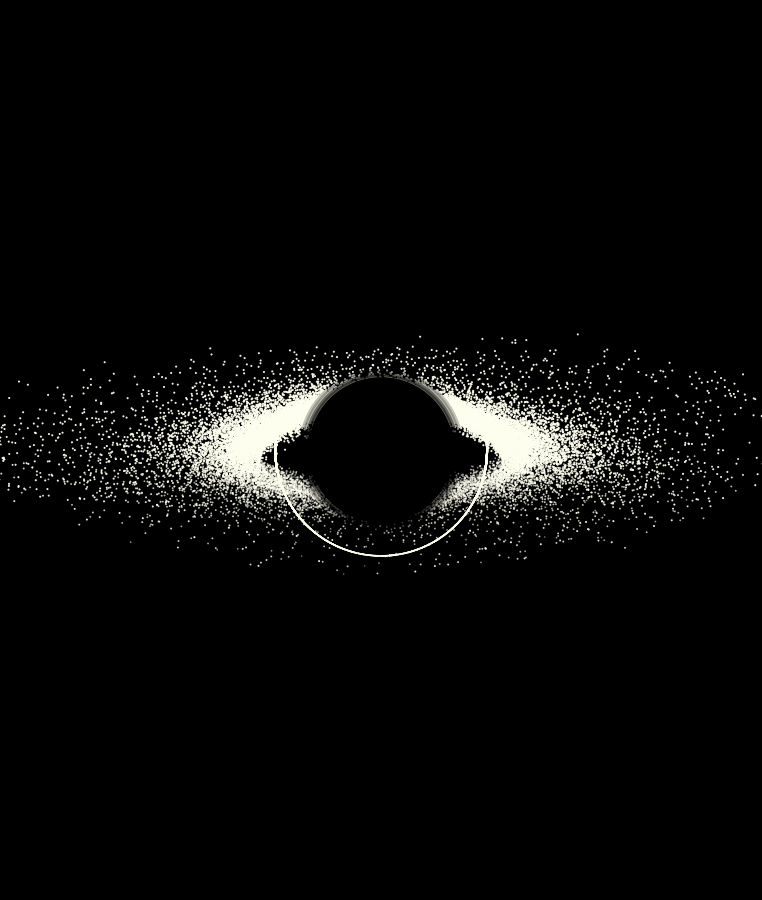

# SimpleLuminet - Black Hole Visualization

A Python implementation of a tilted accretion disk around a black hole, inspired by Jean-Pierre Luminet's famous 1979 black hole visualization. This script generates a scientifically-inspired artistic representation of a black hole with relativistic effects.

## Requirements
- Python 3.6+
- NumPy
- Matplotlib
- Install dependencies with:

`pip install numpy matplotlib`

## Usage
1. Clone or download the repository
2. Install the requirements
3. Run the script:

`python SimpleLuminet.py`

The script will generate a high-resolution PNG image (luminet_style_blackhole.png) of the black hole visualization.

## Technical Notes
The simulation includes:

- Keplerian velocity profile (1/√r)
- Relativistic Doppler boosting
- Gravitational light deflection
- Photon ring formation for light paths orbiting the black hole
- Visibility filtering for parts behind the event horizon
- The output is optimized for print-quality resolution (300 DPI)

### References
Inspired by the original work of Jean-Pierre Luminet (1979), who created the first realistic image of a black hole using early computer simulations.



## Features

- **Realistic accretion disk** with:
  - Steep density gradient (more particles near the center)
  - Vertical stratification
  - Spiral structure with controlled turbulence
  - 75° tilt angle for dramatic perspective

- **Relativistic effects**:
  - Doppler boosting with velocity profile
  - Gravitational lensing simulation
  - Photon ring formation
  - Black hole shadow effect

- **Customizable appearance**:
  - Warm white color palette for vintage feel
  - Gamma correction for better contrast
  - Adjustable point sizes and brightness

## Parameters

Key adjustable parameters in the script:

```python
# Rendering
IMAGE_WIDTH = 1200       # Output image width
IMAGE_HEIGHT = 900       # Output image height
DPI = 300                # Dots per inch (resolution)
BG_COLOR = 'black'       # Background color
POINT_COLOR = '#FFFFF0'  # Warm white for accretion disk

# Black Hole
BH_RADIUS = 0.8          # Event horizon size
PHOTON_RING_SCALE = 1.5  # Photon ring radius multiplier

# Accretion Disk
NUM_POINTS = 50000       # Number of particles
R_INNER = BH_RADIUS * 1.05  # Inner disk radius
R_OUTER = BH_RADIUS * 6.0   # Outer disk radius
DISK_THICKNESS = BH_RADIUS * 0.1  # Disk thickness
TILT_ANGLE = 75°         # Viewing angle
TILT_ANGLE = 75          # Viewing angle (in degrees)

# Physics
DOPPLER_FACTOR = 4.5     # Doppler boosting strength
LENSING_STRENGTH = 1.2   # Gravitational lensing effect
LENSING_STRENGTH = 1.2   # Gravitational lensing effect