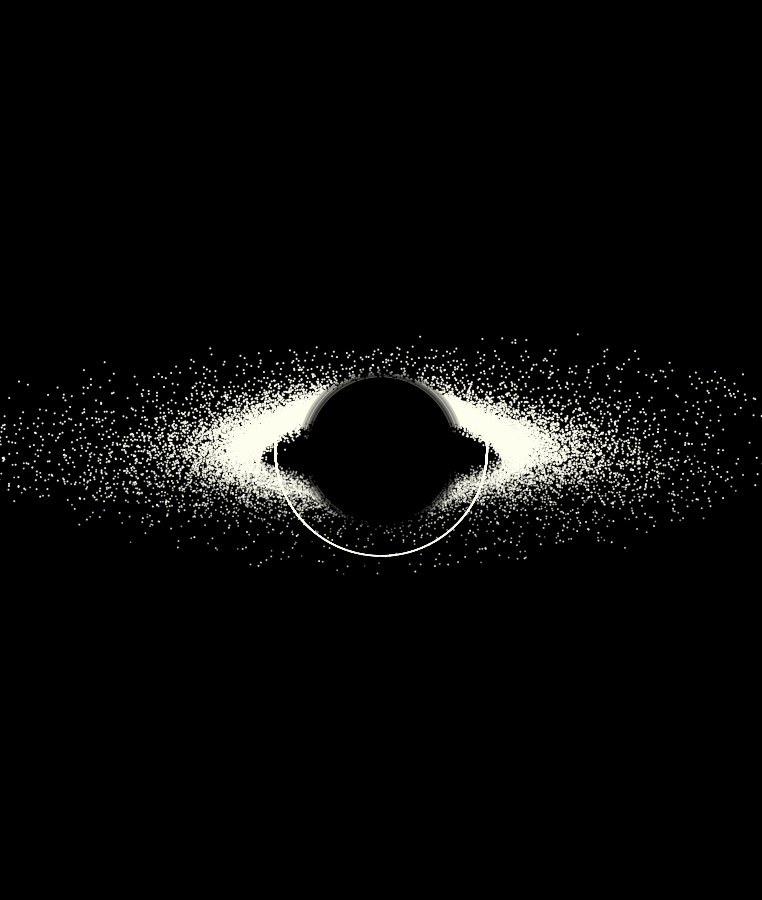
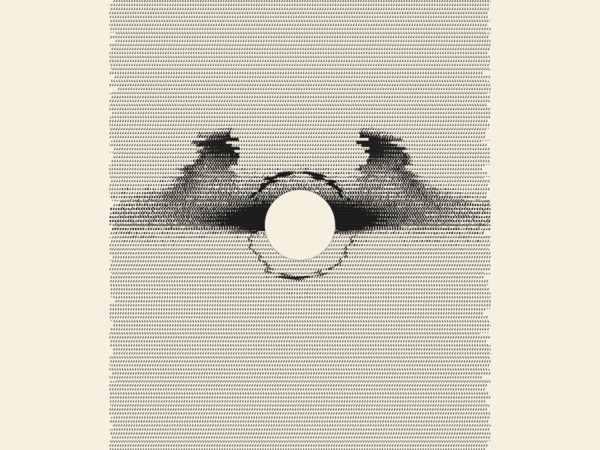

# SimpleLuminet — Black Hole Visualization

A Python implementation of a tilted accretion disk around a black hole, inspired by Jean-Pierre Luminet's famous 1979 black hole visualization. Two renderings are provided: a continuous-tone V1 and a historically accurate dot-matrix printer emulation V2.1.

## Gallery

### V1 — Continuous Scatter (Modern)
Warm-white particles on black background. Smooth gradients, variable point sizes, alpha-blended transparency.



### V2.1 — Bayer-Dithered Dot Matrix (Historically Accurate)
Binary black dots on off-white paper. Bayer 8×8 ordered halftone dithering, gravitational lensing halo, Doppler asymmetry, printer artifacts. Simulates an IBM 1403 line printer at 80 DPI — matching the original 1979 output method.



---

## Physics

Both versions simulate the same relativistic effects on a thin Keplerian accretion disk tilted at 75°:

| Effect | Implementation |
|--------|---------------|
| **Keplerian velocity profile** | v ∝ 1/√r, innermost stable orbit at r = 1.05× event horizon |
| **Relativistic Doppler beaming** | Approaching side (top) boosted by factor 8×, creating 1.7:1 brightness asymmetry |
| **Gravitational lensing** | Far-side light bent upward around the photon sphere (r = 1.5× BH radius), producing the characteristic halo/warp |
| **Photon ring** | Particles at the photon sphere radius form a bright ring just outside the event horizon |
| **Black hole shadow** | Particles behind the event horizon (r < 0.95× BH radius) are occluded |

---

## V2.1 Technical Deep-Dive

### Bayer Ordered Dithering

Instead of continuous shading, V2.1 uses an 8×8 Bayer matrix to produce binary halftone dots — the same technique used by real line printers of the 1970s. Density comes from dot *frequency*, not dot opacity:

```
Bayer 8×8 threshold matrix:
  0/64  32/64   8/64  40/64   2/64  34/64  10/64  42/64
 48/64  16/64  56/64  24/64  50/64  18/64  58/64  26/64
 12/64  44/64   4/64  36/64  14/64  46/64   6/64  38/64
 60/64  28/64  52/64  20/64  62/64  30/64  54/64  22/64
  3/64  35/64  11/64  43/64   1/64  33/64   9/64  41/64
 51/64  19/64  59/64  27/64  49/64  17/64  57/64  25/64
 15/64  47/64   7/64  39/64  13/64  45/64   5/64  37/64
 63/64  31/64  55/64  23/64  61/64  29/64  53/64  21/64
```

A density cell at 0.5 → dot placed only if the corresponding Bayer value < 0.5. The result: brighter regions get more dots, dimmer regions get fewer — all with identical dot sizes.

### Pipeline

```
300K particles → Physics simulation → Lensing deflection
    → Spatial Doppler boost (10× top amplification)
    → Density grid (1200×900) → Gaussian blur (σ=1.5)
    → Gamma correction (γ=0.55) → Bayer dithering (bias=-0.008)
    → Printer artifacts (jitter, banding, misalignment)
    → Render at 80 DPI on #F5F0E0 paper
```

**Final output**: 161,266 binary dots. Top half: 84,703 dots. Bottom half: 48,967 dots. Ratio: 1.73:1.

### Printer Artifacts

Authentic IBM 1403 line printer imperfections are simulated:

- **Pin jitter** (σ=0.03) — slight random displacement of each dot
- **Print-pass banding** — 6-line high print heads create visible horizontal boundaries with 18% dot dropout at band edges
- **Vertical misalignment** — each 6-line pass shifts independently by up to ±0.08 units
- **Fixed dot size** — all dots are 1.2 points, matching physical printer pins
- **Off-white paper** (#F5F0E0) with near-black ink (#1A1A1A) — real ink and paper are never perfect

### Gravitational Lensing Model

The characteristic halo/warp is produced by deflecting light from the far side of the disk (z < 0) upward around the photon sphere:

```python
# Deflection peaks at impact parameter ≈ 1.5 × BH radius (photon sphere)
deflection = 1.8 * BH**1.5 / (|impact - 1.5*BH| + 0.2*BH)

# Upward deflection (positive y) — light bends around the top
y[behind] += deflection * cos(arctan2(y, |x|))

# Radial push creates the edge warp
x[behind] += deflection * 0.3 * (x / r_projected)
y[behind] += deflection * 0.3 * (y / r_projected)
```

This produces the visual signature confirmed by the Event Horizon Telescope in 2019 — 40 years after Luminet's original prediction.

---

## Usage

```bash
pip install numpy matplotlib scipy

# V1 — Modern continuous scatter
python SimpleLuminet.py

# V2 — Original V2 attempt (stochastic dots)
python SimpleLuminetV2.py

# V2.1 — Bayer-dithered dot matrix (recommended)
python SimpleLuminetV2_1.py
```

---

## Parameters

Key tunable parameters in V2.1:

```python
# Printer
PRINTER_DPI = 80           # Simulated line printer resolution
DOT_RADIUS_POINTS = 1.2    # Fixed dot size
BAYER_BIAS = -0.008        # Negative = more dots (tune for 80K-160K target)
BLUR_SIGMA = 1.5           # Gaussian spread for sparse particle density
GAMMA = 0.55               # Contrast curve

# Physics
DOPPLER_FACTOR = 8.0       # Relativistic brightness boost
LENSING_STRENGTH = 1.5     # Gravitational deflection magnitude
TILT_ANGLE = 75            # Degrees from face-on
NUM_POINTS = 300000        # Particle count
```

---

## Historical Reference

Jean-Pierre Luminet's 1979 paper (A&A, 75, 228-235) presented the first computer-generated image of a black hole. Computed on an IBM 7040 and printed on an IBM 1403 line printer using overprinted characters for halftone, Luminet predicted the appearance of the supermassive black hole in M87 — confirmed by the Event Horizon Telescope in 2019.

- **Paper**: [Image of a spherical black hole with thin accretion disk](https://ui.adsabs.harvard.edu/abs/1979A&A....75..228L)
- **Original image**: [Wikimedia Commons](https://commons.wikimedia.org/wiki/File:BH-JPL-A%26A1979.jpg)

---

## License

MIT — see [LICENSE](LICENSE)
